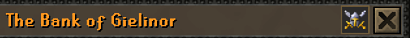

# My BiS Finder

My BiS Finder analyses your banked, equipped and inventory gear to find the fastest
expected time-to-kill (TTK) loadout for your chosen target in Old School RuneScape.

Using your available equipment, combat levels, unlocked content and target-specific
combat mechanics, the plugin calculates and recommends effective Melee, Ranged and
Magic setups to help you defeat enemies as quickly as possible.

## Features

- **Fastest Time-to-Kill Loadouts** — Compares owned Melee, Ranged and Magic
  setups to recommend the lowest estimated kill time for the selected target.
- **Owned Gear Detection** — Uses bank, inventory and equipped items to build
  loadouts from gear you already own.
- **Target-Specific Calculations** — Accounts for enemy defence, weaknesses,
  immunities, damage mechanics and equipment requirements.
- **Advanced Combat Mechanics** — Models weapon passives, enchanted ammunition,
  elemental weaknesses and multi-hit attacks.
- **Slayer Task Integration** — Select a target using your current Slayer task
  and apply relevant Slayer equipment bonuses.
- **Account-Aware Recommendations** — Considers combat levels, quest requirements
  and unlocked prayers.
- **Attack Style Comparison** — Calculates Melee, Ranged and Magic loadouts and
  lets you switch between cached results without recalculating.
- **Bank Loadout Integration** — Provides a dedicated bank view for finding
  recommended equipment and supplies.
- **Loadout Statistics** — Shows estimated TTK, sustained DPS and combat statistics.
- **Offline Calculations** — Uses bundled OSRS Wiki-derived equipment and monster
  data, with no live Wiki requests during play.

## Using the plugin

1. **Scan Your Bank** — Open your bank once to capture owned items. Inventory
   and equipped items are also considered.
2. **Select Your Target** — Choose a monster, or enable **Load Slayer Task** to
   select your current Slayer target.
3. **Generate Your Loadout** — Click **Generate Loadout** to calculate all
   supported attack styles.
4. **Choose Your Attack Style** — Select Slash, Stab, Crush, Ranged or Magic.
   The **BEST** indicator highlights the style with the lowest estimated TTK.
5. **Review Your Loadout** — Check the recommended equipment, estimated TTK,
   DPS and other combat statistics.
6. **Gear Up at the Bank** — Open your bank and click the My BiS Finder button
   in the upper-right corner to view your recommended gear and supplies.

*The My BiS Finder button appears in the upper-right corner of the bank interface.*

## Privacy

All account, bank and loadout processing occurs locally in RuneLite. My BiS Finder
does not transmit account or bank data and does not make external network requests.

## Development

The project targets Java 11 and RuneLite `latest.release`. Run the plugin through
the Gradle `run` task and execute `mechanicsSelfTest` for the mechanics regression
suite before publishing a change.

## AI development and resource-use disclosure

My BiS Finder was developed with substantial assistance from AI coding tools.
The plugin does not make live requests to the OSRS Wiki or other external data
services while RuneLite is running. Wiki-derived equipment, monster, spell and
ammunition data is bundled with the plugin, and all loadout calculations run
locally.

The bundled equipment and monster data snapshot was last refreshed on
**13 September 2026**. See the [data notes](https://github.com/ZeroRuin/my-bis-finder/blob/main/WIKI-DATA-NOTES.txt)
for record counts and snapshot details.

Releases are reviewed, tested and submitted by the maintainer. Mechanics changes
are covered by the project's regression suite and remain subject to RuneLite's
Plugin Hub review process.

## Licence and data

Plugin source is provided under the BSD 2-Clause License. Details for the bundled
offline data pack are recorded in `WIKI-DATA-NOTES.txt` and its manifest.

## Version history

See the [full changelog](https://github.com/ZeroRuin/my-bis-finder/blob/main/CHANGELOG.md).
